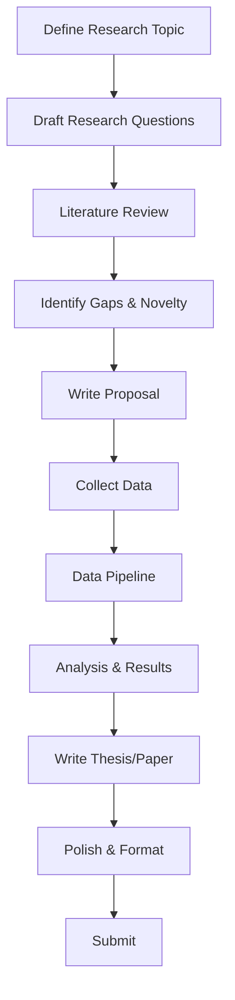

# Research Workflow — AI Agent Guide

> **Core Skills:** All skills in `.agents/skills/` — auto-loaded by VS Code AI assistant  
> **Environment Check:** `python scripts/check_environment.py`  
> **Setup:** See `SETUP.md` for full installation  
> **Skill Reference:** See `AGENTS.md` for skill catalog  
> **Last Updated:** 2026-07-05

---

## Table of Contents

1. [Repository Structure](#1-repository-structure)
2. [Quick Start Bootstrap](#2-quick-start-bootstrap)
3. [Available Tools](#3-available-tools)
4. [Automatic Skill Detection](#4-automatic-skill-detection)
5. [Skill Activation Matrix](#5-skill-activation-matrix)
6. [Research Scripts & When to Use Them](#6-research-scripts--when-to-use-them)
7. [Research Data Storage Conventions](#7-research-data-storage-conventions)
8. [Research Task Workflows](#8-research-task-workflows)
9. [Environment & Health Checks](#9-environment--health-checks)

---

## 1. Repository Structure

```text
research-tool/
│
├── AGENTS.md                  ← Full skill/MCP/agent catalog (READ FIRST)
├── SETUP.md                   ← Installation & dependency guide
├── RESEARCH_WORKFLOW.md       ← THIS FILE — agent execution workflow
│
├── requirements.txt           ← Python dependencies (pip install -r)
├── package.json               ← Node.js dependencies & npm scripts
│
├── .vscode/
│   ├── mcp.json               ← MCP server configurations
│   └── settings.json          ← Editor settings for research
│
├── .agents/
│   └── skills/                ← 48 AI skills (auto-loaded by Copilot)
│       ├── academic-researcher/    ← Literature reviews, paper analysis
│       ├── deep-research/          ← Multi-source research with citations
│       ├── tavily-research/        ← AI-powered web research
│       ├── latex-paper-en/         ← English LaTeX paper assistant
│       ├── latex-thesis-zh/        ← Chinese LaTeX thesis assistant
│       ├── research-paper-writer/  ← IEEE/ACM paper drafting
│       ├── pdf/                    ← PDF extraction & manipulation
│       ├── docx/                   ← Word document creation
│       ├── pptx/                   ← PowerPoint creation
│       ├── xlsx/                   ← Spreadsheet manipulation
│       ├── analyze/                ← Data analysis
│       ├── humanize-academic-writing/ ← Academic text polishing
│       ├── humanizer/              ← Remove AI writing markers
│       ├── web-search/             ← Web search
│       ├── browser-use/            ← Browser automation
│       ├── systematic-debugging/   ← Structured debugging
│       ├── rag-implementation/     ← RAG system building
│       ├── ml-pipeline-workflow/   ← ML pipeline design
│       ├── python-*/               ← 13 Python development skills
│       └── ...                     ← 48 skills total
│
├── scripts/                    ← Reusable automation scripts
│   ├── check_environment.py    ← Verify all tools installed
│   ├── setup_env.ps1           ← One-command environment setup
│   ├── validate_csv.py         ← CSV data validation
│   ├── clean_csv.py            ← CSV data cleaning
│   └── generate_schema_diagram.py ← ER/schema diagram generation
│
├── templates/                  ← Document templates & patterns
│   ├── latex-guide.md          ← Comprehensive LaTeX reference
│   ├── guidelines/             ← Project report & proposal formats
│   │   ├── proposal.md
│   │   ├── project_report.md
│   │   ├── presentation.md
│   │   ├── Proposal_Format_Guide.md
│   │   └── Project_Report_Format_Guide.md
│   ├── references/             ← Research platform & tool guides
│   │   ├── research_platforms_guide.csv
│   │   └── tools_accounts_guide.csv
│   ├── patterns/               ← Reusable code/structure patterns
│   │   ├── thesis-audit-template.md
│   │   └── latex-variables-pattern.md
│   └── thesis-book/            ← Full LaTeX thesis book template
│       ├── report.tex
│       ├── formatting.tex
│       ├── packages.tex
│       ├── abbreviations.tex
│       ├── references.bib
│       ├── university-guide.md
│       ├── chapters/           ← 6 chapter templates
│       ├── front-matter/       ← Title, abstract, declaration, etc.
│       ├── images/
│       └── logos/
│
├── .github/
│   └── workflows/
│       └── validate.yml        ← CI: Python lint + JSON validation
│
├── .mcp-servers/               ← Optional cloned MCP servers
│   ├── multi_mcp/              ← Multi-model code review
│   └── Blind-Auditor/          ← Self-auditing code review
│
├── data/                       ← RESEARCH DATA (create as needed)
│   ├── datasets/               ← Raw & processed datasets
│   ├── outputs/                ← Pipeline outputs, results
│   └── notebooks/              ← Jupyter notebooks
│
├── papers/                     ← DOWNLOADED PAPERS (create as needed)
│   ├── to-read/                ← Papers to review
│   ├── read/                   ← Reviewed papers
│   └── summaries/              ← Paper summaries
│
├── literatures/                ← LITERATURE REVIEW (create as needed)
│   ├── reading-list/           ← Reading lists organized by topic
│   ├── summaries/              ← Paper summaries & annotated bibliographies
│   ├── matrices/               ← Literature comparison matrices
│   └── notes/                  ← Reading notes & critical analysis
│
├── extractions/                ← EXTRACTED DATA FROM PAPERS (create as needed)
│   ├── tables/                 ← Extracted tables from papers
│   ├── figures/                ← Extracted figures & images
│   ├── quotes/                 ← Important quotes with citations
│   └── data/                   ← Structured data points extracted from papers
│
├── thesis/                     ← THESIS/PROJECT WRITING (create as needed)
│   └── report/                 ← LaTeX source, per thesis-book template
│
├── docs/                       ← PROJECT DOCUMENTATION (create as needed)
│   ├── proposals/              ← Research proposals
│   ├── reports/                ← Progress reports
│   └── meetings/               ← Meeting notes
│
├── .editorconfig
├── .gitignore
└── README.md
```

---

## 2. Quick Start Bootstrap

Every research session starts here:

```powershell
# 1. Activate Python virtual environment
.venv\Scripts\Activate.ps1

# 2. Verify environment
python scripts/check_environment.py

# 3. Install npm dependencies (if not done)
npm install
```

**Before any research task**, the AI agent should:

1. ✅ Check `AGENTS.md` for available skills
2. ✅ Check `SETUP.md` if tools need installation
3. ✅ Run `scripts/check_environment.py` if unsure about setup
4. ✅ Use appropriate MCP servers via `.vscode/mcp.json`

---

## 3. Available Tools

### 3.1 MCP Servers (via `.vscode/mcp.json`)

| Server                  | Tools / Capabilities                                                         | When to Use                                                      | Setup Needed                          |
| ----------------------- | ---------------------------------------------------------------------------- | ---------------------------------------------------------------- | ------------------------------------- |
| **filesystem**          | Read/write workspace files                                                   | Always available — reading/writing any file                      | None (pre-configured)                 |
| **sequential-thinking** | Structured step-by-step reasoning via `mcp_sequential-th_sequentialthinking` | Complex research problems, methodology design, paper structuring | None (pre-configured)                 |
| **puppeteer**           | `browser_navigate`, `browser_click`, `browser_snapshot`, etc.                | Web scraping, data collection, screenshot capture                | `npm install -g mcp-server-puppeteer` |
| **brave-search**        | Web search via Brave Search API                                              | Literature search, web research, fact-checking                   | Brave Search API key in env           |
| **multi-mcp**           | `mcp_mcp-web-searc_web_search_prime`, multi-model analysis                   | Consensus-based code review, multi-perspective analysis          | Clone repo to `.mcp-servers/`         |
| **blind-auditor**       | Code auditing & self-review                                                  | Mandatory quality gate before finalizing code                    | Clone repo to `.mcp-servers/`         |

### 3.2 Python Scripts

| Script                               | Purpose                                        | When to Use                                            |
| ------------------------------------ | ---------------------------------------------- | ------------------------------------------------------ |
| `scripts/check_environment.py`       | Verify all tools & dependencies installed      | Session start, or when tools feel broken               |
| `scripts/setup_env.ps1`              | One-command full environment setup             | First-time setup, or after cloning                     |
| `scripts/validate_csv.py`            | Validate CSV structure, fill rates, data types | After collecting/creating a CSV dataset                |
| `scripts/clean_csv.py`               | Clean/transform CSV data                       | Before analysis on a messy CSV                         |
| `scripts/generate_schema_diagram.py` | Generate ER/schema diagrams (Graphviz)         | When documenting database schema or data relationships |

### 3.3 npm Scripts

| Script           | Command                                          | Purpose                       |
| ---------------- | ------------------------------------------------ | ----------------------------- |
| `npm run format` | `prettier --write .`                             | Format all markdown/JSON/YAML |
| `npm run setup`  | `pip install -r requirements.txt && npm install` | Full dependency install       |

### 3.4 MCP Web Search & Reader Tools

| Tool                                   | Purpose                               | When to Use                                     |
| -------------------------------------- | ------------------------------------- | ----------------------------------------------- |
| `mcp_mcp-web-searc_web_search_prime`   | Web search via multi-mcp              | Finding papers, data sources, background info   |
| `vscode-websearchforcopilot_webSearch` | Web search built into VS Code Copilot | Quick web lookups                               |
| `mcp_web-reader-se_webReader`          | Fetch & convert URL to clean text/MD  | Reading paper PDFs, web articles, documentation |

---

## 4. Automatic Skill Detection

**Skills activate automatically** based on keywords in user messages or detected research task context:

| Keywords Detected                               | Skill Activated                   | Context                                 |
| ----------------------------------------------- | --------------------------------- | --------------------------------------- |
| "literature review", "paper analysis"           | `academic-researcher`             | Reviewing & analyzing papers            |
| "deep research", "comprehensive analysis"       | `deep-research`                   | Multi-source research with citations    |
| "research", "investigate", "market analysis"    | `tavily-research`                 | AI-powered web research                 |
| "thesis", "proposal", "project", "presentation" | `thesis-workflow`                 | Thesis/project document generation      |
| "analyze data", "trend", "statistical"          | `analyze`                         | Data analysis & reporting               |
| "data story", "data narrative", "visualization" | `data-storytelling`               | Crafting narratives from research data  |
| "validate data", "data quality", "integrity"    | `data-quality-frameworks`         | Data quality validation                 |
| "compile LaTeX", "proofread paper"              | `latex-paper-en`                  | English LaTeX paper assistance          |
| "毕业论文", "学位论文"                          | `latex-thesis-zh`                 | Chinese LaTeX thesis assistance         |
| "write research paper", "conference paper"      | `research-paper-writer`           | IEEE/ACM paper drafting                 |
| "Word doc", ".docx"                             | `docx`                            | Word document creation/editing          |
| "slide deck", "presentation", ".pptx"           | `pptx`                            | PowerPoint creation                     |
| ".pdf", "merge PDF", "extract PDF"              | `pdf`                             | PDF manipulation & extraction           |
| "spreadsheet", ".xlsx", ".csv"                  | `xlsx`                            | Spreadsheet creation/editing/cleaning   |
| "humanize text", "AI detection"                 | `humanize-academic-writing`       | Academic text naturalization            |
| "make more natural", "AI writing"               | `humanizer`                       | Remove AI writing markers               |
| "search web", "find information", "look up"     | `web-search`                      | Web search with snippets & filters      |
| "browser automation", "web scraping"            | `browser-use`                     | Browser automation for data collection  |
| "RAG", "retrieval augmented"                    | `rag-implementation`              | Building RAG systems                    |
| "ML pipeline", "MLOps", "training pipeline"     | `ml-pipeline-workflow`            | ML pipeline design                      |
| "debug", "bug fix", "troubleshoot"              | `systematic-debugging`            | Structured debugging                    |
| "MCP server", "MCP tool", "custom MCP"          | `mcp-builder`                     | Building custom MCP servers             |
| "FastAPI", "API", "REST"                        | `fastapi-templates`               | Building research model APIs            |
| "image processing", "OCR", "image analysis"     | `image-processing`                | Processing research figures             |
| "data quality", "data contracts"                | `data-quality-frameworks`         | Data validation pipelines               |
| "prompt engineering", "chain-of-thought"        | `prompt-engineering-patterns`     | Prompt design & optimization            |
| "vector search", "embedding", "index"           | `vector-index-tuning`             | Vector index optimization               |
| "embedding", "text embedding"                   | `embedding-strategies`            | Embedding model selection               |
| "similarity search", "semantic search"          | `similarity-search-patterns`      | Semantic search implementation          |
| "LangChain", "AI agent", "LLM chain"            | `langchain-architecture`          | LangChain application design            |
| "user research plan", "interview guide"         | `user-research`                   | User research methodology               |
| "git workflow", "branch strategy", "rebase"     | `git-advanced-workflows`          | Advanced Git for research collaboration |
| "TDD", "test first"                             | `test-driven-development`         | Test-driven research code               |
| "task coordination", "parallel work"            | `task-coordination-strategies`    | Multi-step research orchestration       |
| "API key", "secret", "credential"               | `secrets-management`              | Secure credential management            |
| "bash script", "shell script", "automation"     | `bash-defensive-patterns`         | Robust shell scripting                  |
| "uv", "package manager"                         | `uv-package-manager`              | Fast Python dependency management       |
| "python project structure"                      | `python-project-structure`        | Module architecture & organization      |
| "code style", "PEP 8"                           | `python-code-style`               | Python coding standards                 |
| "anti-pattern", "code smell"                    | `python-anti-patterns`            | Common Python mistakes                  |
| "design pattern"                                | `python-design-patterns`          | Python design patterns                  |
| "error handling", "exception"                   | `python-error-handling`           | Robust error handling                   |
| "unit test", "pytest", "testing"                | `python-testing-patterns`         | Testing strategies                      |
| "type hint", "mypy", "pyright"                  | `python-type-safety`              | Type annotations & checking             |
| "performance", "optimization", "profiling"      | `python-performance-optimization` | Code optimization                       |
| "logging", "monitoring", "observability"        | `python-observability`            | Logging & tracing                       |
| "config", "settings", "environment"             | `python-configuration`            | Configuration management                |
| "context manager", "resource", "with statement" | `python-resource-management`      | Resource management                     |
| "package", "PyPI", "setup.py"                   | `python-packaging`                | Package creation & distribution         |
| "organize research", "references"               | `persona-researcher`              | Reference & notes management            |

---

## 5. Skill Activation Matrix

| Research Task                | Required Skills                                                              | Recommended Scripts / Tools                                                  |
| ---------------------------- | ---------------------------------------------------------------------------- | ---------------------------------------------------------------------------- |
| **Literature Review**        | `academic-researcher`, `deep-research`, `tavily-research`, `web-search`      | `mcp_mcp-web-searc_web_search_prime`, `vscode-websearchforcopilot_webSearch` |
| **Paper Summary**            | `academic-researcher`, `pdf`, `web-search`                                   | `mcp_web-reader-se_webReader`, `sequential-thinking`                         |
| **Thesis Writing**           | `thesis-workflow`, `latex-paper-en`, `research-paper-writer`                 | `templates/thesis-book/` template, `templates/latex-guide.md`                |
| **Data Analysis**            | `analyze`, `data-storytelling`, `data-quality-frameworks`                    | `scripts/validate_csv.py`, `scripts/clean_csv.py`, `xlsx` skill              |
| **Data Collection (Web)**    | `browser-use`, `web-search`                                                  | Puppeteer MCP, Playwright, `requests` + `bs4` (Python)                       |
| **PDF Extraction**           | `pdf`                                                                        | `pymupdf` (Python), `mcp_web-reader-se_webReader`                            |
| **DOCX Extraction**          | `docx`                                                                       | `python-docx` (Python)                                                       |
| **XLSX/CSV to MD**           | `xlsx`                                                                       | `pandas` + `tabulate` (Python)                                               |
| **Image OCR**                | `image-processing`                                                           | `pytesseract` + `pillow` (Python)                                            |
| **LaTeX Compilation**        | `latex-paper-en` or `latex-thesis-zh`                                        | `pdflatex`, `latexmk` (MiKTeX)                                               |
| **Presentation Creation**    | `pptx`                                                                       | `pptxgenjs` (Node.js)                                                        |
| **Code Quality**             | `systematic-debugging`, `test-driven-development`, `python-testing-patterns` | `multi-mcp` MCP, `blind-auditor` MCP                                         |
| **Research Figure Creation** | `image-processing`                                                           | `matplotlib`, `seaborn` (Python)                                             |
| **API for Research Model**   | `fastapi-templates`, `ml-pipeline-workflow`                                  | FastAPI + Uvicorn                                                            |
| **RAG / Knowledge Base**     | `rag-implementation`, `embedding-strategies`, `vector-index-tuning`          | `transformers` (Python)                                                      |
| **ML Pipeline**              | `ml-pipeline-workflow`, `python-*` suite                                     | `scikit-learn`, `transformers` (Python)                                      |
| **Prompt Engineering**       | `prompt-engineering-patterns`                                                | `sequential-thinking` MCP                                                    |
| **Academic Writing Polish**  | `humanize-academic-writing`, `humanizer`                                     | —                                                                            |
| **Resource Management**      | `secrets-management`, `bash-defensive-patterns`                              | `.env` files, `scripts/setup_env.ps1`                                        |
| **Multi-step Research**      | `task-coordination-strategies`                                               | `manage_todo_list` tool                                                      |
| **Version Control**          | `git-advanced-workflows`                                                     | Git CLI                                                                      |

---

## 6. Research Scripts & When to Use Them

### `scripts/check_environment.py`

**Purpose:** Verify all required tools, packages, and dependencies are installed.  
**When to use:** At session start, after cloning, or when encountering tool errors.  
**Usage:**

```powershell
python scripts/check_environment.py           # Standard output
python scripts/check_environment.py --json    # JSON output (CI)
python scripts/check_environment.py --verbose # Detailed diagnostics
```

**It checks:** Python ≥3.10, Node.js ≥18, npm, LaTeX/MiKTeX, all pip packages, all npm packages, data extraction libs, MCP server configs.

### `scripts/setup_env.ps1`

**Purpose:** One-command full environment setup.  
**When to use:** First-time setup or after pulling new changes.  
**Usage:**

```powershell
.\scripts\setup_env.ps1
```

### `scripts/validate_csv.py`

**Purpose:** Validate CSV structure, column fill rates, data type detection, and generate quality reports.  
**When to use:** After collecting a new CSV dataset, before running analysis.  
**Usage:**

```powershell
python scripts/validate_csv.py data.csv --output validation_report.md --format markdown
python scripts/validate_csv.py data.csv --format text                     # Terminal output
```

### `scripts/clean_csv.py`

**Purpose:** Clean and transform CSV data — drop/keep columns, filter rows, fill missing values, rename/reorder columns.  
**When to use:** When working with messy or malformed CSV data before analysis.  
**Usage:**

```powershell
python scripts/clean_csv.py messy.csv --drop-empty-rows --fill-missing 0 --dry-run
python scripts/clean_csv.py messy.csv --drop-pattern "^unnamed" --output clean.csv
```

### `scripts/generate_schema_diagram.py`

**Purpose:** Generate ER/schema diagrams from SQL DDL, JSON schemas, or CSV headers using Graphviz.  
**When to use:** When documenting database schemas, data relationships, or research data models.  
**Usage:**

```powershell
python scripts/generate_schema_diagram.py schema.sql --output diagram.png
python scripts/generate_schema_diagram.py data.csv --output er-diagram.png --color
```

---

## 7. Research Data Storage Conventions

| Data Type           | Store In                        | Naming Convention                                 | Notes                                               |
| ------------------- | ------------------------------- | ------------------------------------------------- | --------------------------------------------------- |
| Raw datasets        | `data/datasets/`                | `{source}_{description}.csv`                      | Never modify raw data in place                      |
| Processed data      | `data/datasets/processed/`      | `{description}_clean.csv`                         | Output of `clean_csv.py` or pipeline                |
| Pipeline outputs    | `data/outputs/`                 | `{pipeline}_{date}.json/csv`                      | Results from data processing                        |
| Jupyter notebooks   | `data/notebooks/`               | `{number}-{description}.ipynb`                    | Number sequentially                                 |
| Downloaded papers   | `papers/to-read/`               | `{author_year}_{short_title}.pdf`                 | Before reading                                      |
| Reviewed papers     | `papers/read/`                  | `{author_year}_{short_title}.pdf`                 | After reading + summary                             |
| Paper summaries     | `literatures/summaries/`        | `{author_year}_{short_title}.md`                  | Key findings, methods, critiques                    |
| Reading lists       | `literatures/reading-list/`     | `{topic}_reading_list.md`                         | Curated lists of papers by topic                    |
| Literature matrices | `literatures/matrices/`         | `{topic}_matrix.{csv,xlsx}`                       | Comparison tables across papers                     |
| Literature notes    | `literatures/notes/`            | `{topic}_notes.md`                                | Annotated bibliographies, critical analysis         |
| Thesis LaTeX source | `thesis/report/`                | Per `templates/thesis-book/` structure            | Use `variables_N.tex` pattern                       |
| Extracted tables    | `extractions/tables/`           | `{paper_short_title}_table{N}.{csv,xlsx}`         | Tables extracted from papers                        |
| Extracted figures   | `extractions/figures/`          | `{paper_short_title}_fig{N}.{png,jpg,svg}`        | Figures/images extracted from papers                |
| Extracted quotes    | `extractions/quotes/`           | `{paper_short_title}_quotes.md`                   | Important quotes with page numbers                  |
| Extracted data      | `extractions/data/`             | `{paper_short_title}_{description}.{csv,json}`    | Structured data points extracted from papers        |
| Research proposals  | `docs/proposals/`               | `{topic}_proposal.md`                             | Use `templates/guidelines/proposal.md`              |
| Progress reports    | `docs/reports/`                 | `{YYYY-MM-DD}_progress.md`                        | Periodic updates                                    |
| Meeting notes       | `docs/meetings/`                | `{YYYY-MM-DD}_{topic}.md`                         | Timestamped                                         |
| Audit issues        | `thesis/report/thesis-audit.md` | Per `templates/patterns/thesis-audit-template.md` | Track all thesis issues                             |
| LaTeX variables     | Per chapter directory           | `variables_N.tex`                                 | Per `templates/patterns/latex-variables-pattern.md` |

---

## 8. Research Task Workflows

### 8.1 New Research Project



**Skills used:** `thesis-workflow` → `academic-researcher` → `deep-research` → `research-paper-writer` → `latex-paper-en` → `humanize-academic-writing`

### 8.2 Literature Review

```text
1. Use `deep-research` skill: "Deep research on [TOPIC]"
   → Multi-source search with citations

2. Use `tavily-research` skill: "Research [TOPIC] with citations"
   → AI-powered structured report

3. Download papers → store in `papers/to-read/`
   Use `mcp_web-reader-se_webReader` to fetch paper PDFs/HTML

4. Use `academic-researcher` skill: "Analyze paper at papers/to-read/{file}"
   → Extract methodology, findings, limitations

5. Move reviewed papers to `papers/read/`
   Create summary in `literatures/summaries/{author_year}_{title}.md`
   Take reading notes in `literatures/notes/{topic}_notes.md`

6. Build literature comparison matrices in `literatures/matrices/`
   Use `xlsx` skill: "Create comparison matrix for [TOPIC] papers"

7. Track reading list in `literatures/reading-list/{topic}_reading_list.md`
   Include priority, status (to-read/reading/read), and key takeaways
```

### 8.3 Data Collection & Processing

```text
1. Web scraping → Use `browser-use` skill or Puppeteer MCP
   OR manual CSV collection → store in `data/datasets/`

2. Validate data:
   python scripts/validate_csv.py data/datasets/{file}.csv --format markdown

3. Clean data:
   python scripts/clean_csv.py data/datasets/{file}.csv --drop-empty-rows --output data/datasets/processed/{file}_clean.csv

4. Run analysis → Use `analyze` skill or custom Python scripts
   Store outputs in `data/outputs/`

5. Generate visualizations → Use `data-storytelling` skill
   Use matplotlib/seaborn for publication figures
```

### 8.4 Thesis Writing (LaTeX)

```text
1. Use `templates/thesis-book/` as starting structure
   Copy to `thesis/report/`

2. Follow `templates/latex-guide.md` for LaTeX reference

3. Use `templates/patterns/latex-variables-pattern.md` for per-chapter constants
   Create `variables_N.tex` in each chapter directory

4. Compile:
   cd thesis/report
   latexmk -pdf report.tex

5. Track issues in `thesis/report/thesis-audit.md`
   Use `templates/patterns/thesis-audit-template.md` format

6. Use `latex-paper-en` skill for proofreading & fixes
   "Fix bibliography in thesis/report/report.tex"
   "Check three-line tables in Chapter 5"

7. Use `humanize-academic-writing` skill to polish
   "Humanize Chapter 3 methodology section"
```

### 8.5 Data Extraction Pipeline

```text
PDF → Text:      `pymupdf`  →  python -c "import fitz; print(fitz.open('file.pdf')[0].get_text())"
DOCX → Text:     `python-docx`  →  python scripts/convert_docx.py (if created)
XLSX → CSV:      `openpyxl` / `pandas`  →  pandas.read_excel('file.xlsx').to_csv('output.csv')
CSV → Markdown:  `tabulate`  →  pandas.read_csv('file.csv').to_markdown('output.md')
Image → Text:    `pytesseract`  →  python -c "import pytesseract; print(pytesseract.image_to_string('image.png'))"
Web → Markdown:  `markdownify`  →  See SETUP.md section 5
```

**Store all extraction outputs in `extractions/` subdirectories:**

- Tables → `extractions/tables/{paper_short_title}_table{N}.{csv,xlsx}`
- Figures → `extractions/figures/{paper_short_title}_fig{N}.{png,jpg,svg}`
- Quotes → `extractions/quotes/{paper_short_title}_quotes.md`
- Data → `extractions/data/{paper_short_title}_{description}.{csv,json}`

### 8.6 Research Code Development

```text
1. Outline → Use `task-coordination-strategies` for multi-step tasks

2. Implement → Use appropriate `python-*` skills:
   - `python-project-structure` for module layout
   - `python-code-style` for conventions
   - `python-design-patterns` for architecture
   - `python-error-handling` for robustness

3. Type-check:
   mypy script.py --strict  →  Uses `python-type-safety` patterns

4. Test → Use `test-driven-development` skill
   pytest tests/  →  Uses `python-testing-patterns`

5. Performance → Use `python-performance-optimization` if slow

6. Code Review → Use `multi-mcp` MCP for multi-model review
   Use `blind-auditor` MCP for self-audit
```

### 8.7 Presentation Creation

```text
1. Use `pptx` skill: "Create presentation on [TOPIC]"
   Outputs .pptx file

2. Use `data-storytelling` skill to craft narrative

3. Store in `docs/presentations/` or project root
```

---

## 9. Environment & Health Checks

### At Session Start

```powershell
# Check all tools are ready
python scripts/check_environment.py

# Activate virtual environment if not active
.venv\Scripts\Activate.ps1

# Verify MCP servers are configured
# → Check .vscode/mcp.json for server list
```

### Quick Diagnostic Commands

```powershell
# Python version
python --version

# Node.js version
node --version

# LaTeX availability
latex --version
pdflatex --version
latexmk --version

# Virtual environment
pip list  # Should show packages from requirements.txt
```

### If Something Is Missing

| Problem                     | Solution                                               |
| --------------------------- | ------------------------------------------------------ |
| Python packages missing     | `pip install -r requirements.txt`                      |
| npm packages missing        | `npm install`                                          |
| LaTeX not found             | Install MiKTeX from <https://miktex.org/download>      |
| MCP server not working      | Check `.vscode/mcp.json` config                        |
| Virtual environment missing | `python -m venv .venv && .\.venv\Scripts\Activate.ps1` |
| General setup issues        | Run `.\scripts\setup_env.ps1` or see `SETUP.md`        |

---

Last updated: 2026-07-04
